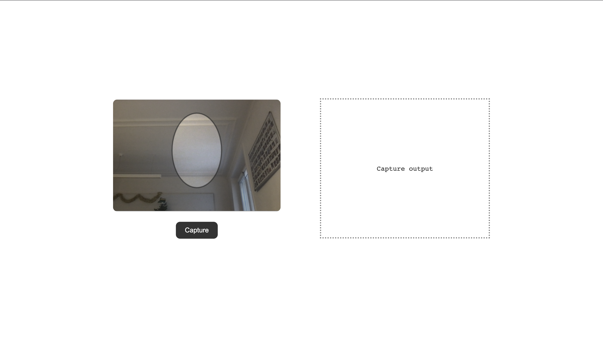

# SDK web js example

## Introduction

In this project we are using [Unissey javascript SDK](https://github.com/unissey/sdk-web-js/pkgs/npm/sdk-web-js/62620965)for recording a video and displaying the output in the same web page.

[Try it here](https://astounding-jelly-e183ec.netlify.app/)



## Get a personnal access token

First generate an access token by following this link. Make sure to include at least the `repo` and `read:packages` permission to the access token.

Then, to get access permissions, you will need to contact someone from the Unissey organisation with your github account name.

## Setup the project

-   Clone the repository

```bash
git clone git@github.com:unissey/sdk-web-examples.git
```

-   Change directory to sdk-web-js

```bash
cd sdk-web-js
```

-   Authenticate to github npm registry

Create `NPM_TOKEN` environnment variable with your github personnal token

```bash
export NPM_TOKEN = <Your github personnal token>
```

-   Install dependencies

```bash
npm install
```

## Run the project

```
npm run dev
```

Open [http://localhost:5000](http://localhost:5000) and your are done!


## Files overview

* `src/video-recorder.js` A vanilla [web component](https://developer.mozilla.org/en-US/docs/Web/API/Web_components) that displays video, canvas elements and a button to start the capture. It create a recording session and setup lifecycle methods
* `src/main.js` handle capture result and displays it on the page. It handle preset change
* `public/index.html` html page, it contains [template](https://developer.mozilla.org/en-US/docs/Web/API/Web_components/Using_templates_and_slots) for `video-recorder` component